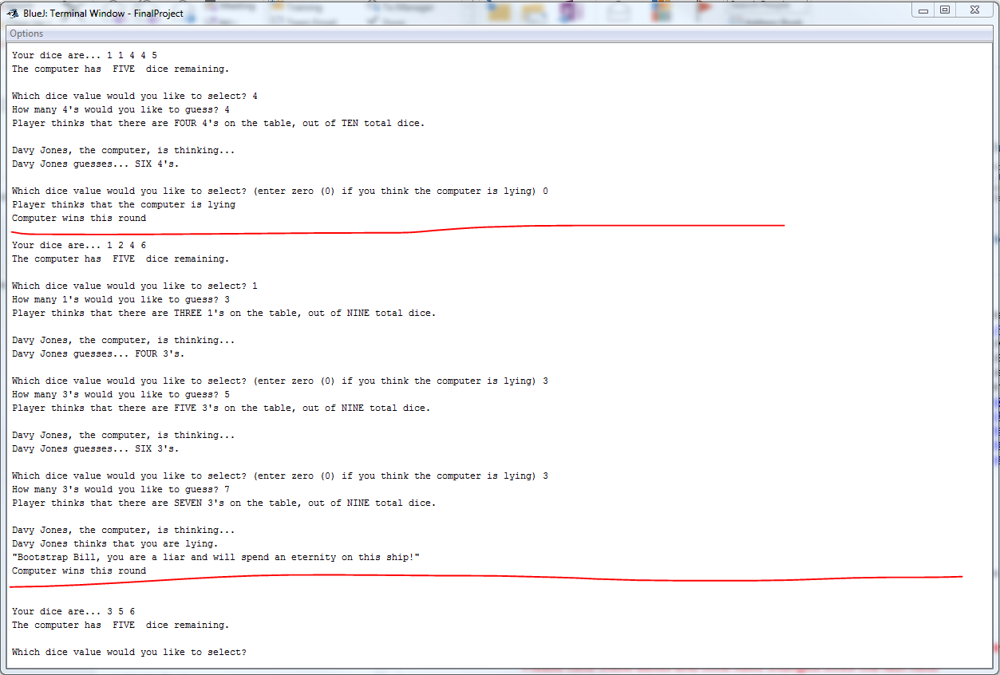
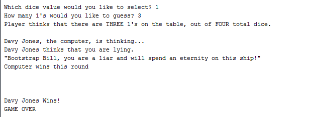

# Liar's Dice (LiarsDice.java, Main.java)
## Synopsis

These scripts are a modified text version of the game Liar's Dice that was made popular by the Pirates of the Caribbean movies.  The game is basically BS for dice.  Each player starts with 5 dice.  You are able to view your dice after you roll but not the other players.  Your goal is to guess the number of dice on the table of the die face value that you choose (one's are wild).  

## Motivation

These scripts were written for a final project in my Java I course.  Improvements can definitely be made in the future to remove the gameplay modifications that I made, and to perhaps add a GUI.

Gameplay starts by players rolling dice.  Player one rolls 1,1,2,3,5; Player two rolls 1,3,4,4,5.  Player one guesses that there are FOUR 3's, player two guesses that there are FIVE 4's, player one doesn't believe that there are FIVE 4's on the table, so player one thinks player two is 'lying'.  Player one loses because there are indeed 5 points (**1,1**,2,3,5) (**1**,3,**4,4**,5). If you lose the turn, you lose a die.

You must increase your guess number by at least one for every turn.  You may change the dice face value at any time.

This is a modified version of Liar's Dice:

+ There are certain differences for the value of one in the real game, but those weren't coded in
+ In the real game you should be able to increment the die face value and not change the number of dice (for instance: if the previous guess was four 5's, you can say four 6's) but this was not coded in
+ The loser of the round typically starts the bidding, but in my code the player always starts
+ There are usually more than 2 players, but this code only has one human player and the computer

## Installation

Download the .java files, compile and run the main method.

## Tests

Multiple modifications were made to the game functionality.  Player 2's (the computer) thresholds can be modified to be 'smarter', although I can never seem to win as it is.

## Contributors

Michael Harris is the author of these script's.

[StackOverflow] (http://stackoverflow.com/users/4530995/michael-harris)

[LinkedIN] (https://www.linkedin.com/in/michael-harris-366b0060/)

## License

This code is available under the [MIT License.] (LICENSE)

